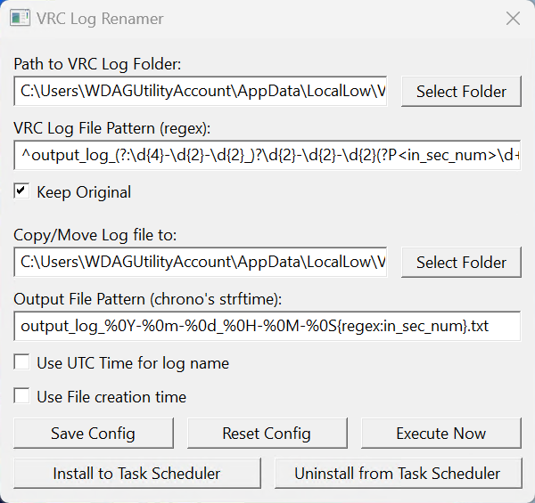

# VRC Log Renamer

The tool to rename VRChat Log files and keep log file forever.

## How to use

### GUI

Double-click the exe to start GUI Mode

- Click "Execute Now" to run renamer once.
- Click "Install to Task Scheduler" to run daily and "Uninstall from Task Scheduler" to stop daily run.

### CUI

execute `vrc-log-renamer.exe help` to know how to use CUI mode.
